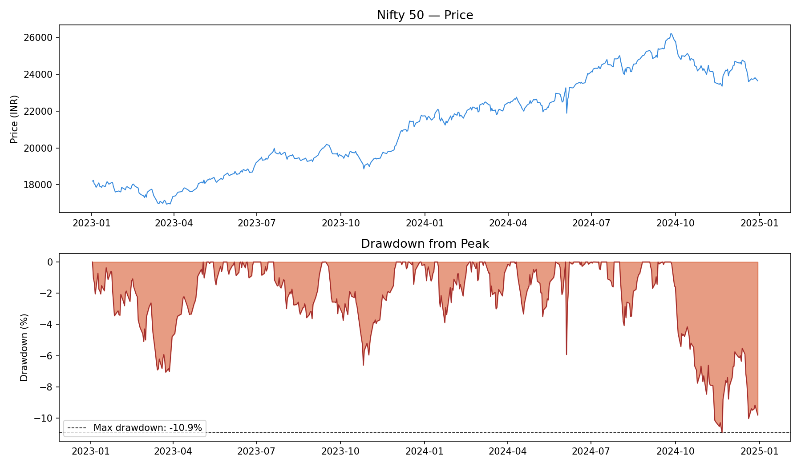
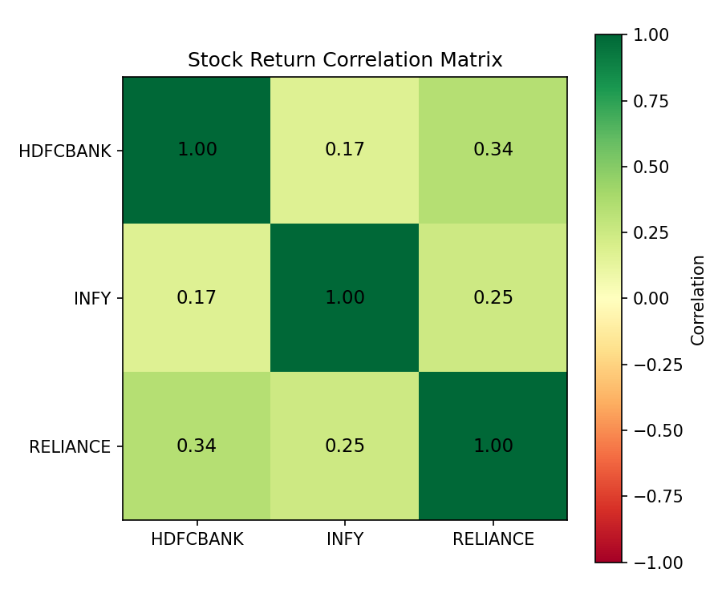

# India Risk Dashboard

A Python tool for risk analysis of Indian equities.

## What it does
- Pulls live NSE/BSE stock data using yfinance
- Computes daily returns, annualised volatility, rolling volatility, Sharpe ratio, and maximum drawdown
- Compares risk-adjusted performance across the Nifty 50 index and individual stocks

## Sample output — Risk Report (Jan 2023 – Dec 2024)

| Ticker | Annualised Vol | Sharpe Ratio | Max Drawdown | Max DD Date |
|--------|----------------|--------------|---------------|-------------|
| Nifty 50 (^NSEI) | 12.14% | 0.637 | -10.93% | 2024-11-21 |
| HDFC Bank | 19.82% | 0.065 | -19.91% | 2024-02-14 |
| Reliance | 20.36% | -0.154 | -24.46% | 2024-12-20 |

## Key finding
Individual stocks (HDFC Bank, Reliance) carried significantly more risk than the Nifty 50 index but did not proportionally reward investors — Reliance's negative Sharpe ratio over this period means investors would have been better off in risk-free government securities. This illustrates the practical value of diversification.

## Portfolio analysis (Week 1, Day 6)

Built an equal-weighted 3-stock portfolio (HDFC Bank, Reliance, Infosys) to test diversification in practice.

| Metric | Value |
|--------|-------|
| Portfolio annualised volatility | 14.91% |
| Simple average of individual stock volatilities | 21.09% |
| **Diversification benefit** | **6.18 percentage points lower** |
| Portfolio 1-day VaR (95%) | -1.33% |
| Portfolio 1-day VaR (99%) | -2.50% |

### Correlation matrix

| | HDFC Bank | Infosys | Reliance |
|---|---|---|---|
| HDFC Bank | 1.000 | 0.171 | 0.338 |
| Infosys | 0.171 | 1.000 | 0.246 |
| Reliance | 0.338 | 0.246 | 1.000 |

**Key finding:** Combining three stocks from different sectors (banking, IT services, energy) reduced portfolio volatility by 6.18 percentage points versus the simple average of the individual stocks — a direct, quantified demonstration of diversification. This works because the pairwise correlations are low (0.17–0.34), meaning the stocks rarely have their worst days at the same time.

On a ₹10L portfolio, this analysis implies a 1-in-20 day loss exceeding ₹13,262 (95% VaR) and a 1-in-100 day loss exceeding ₹24,961 (99% VaR).

## Built with
Python, pandas, yfinance, matplotlib, numpy

## Status
🚧 In progress — Week 1 of 8. Currently building portfolio-level analysis (Week 2-3).
