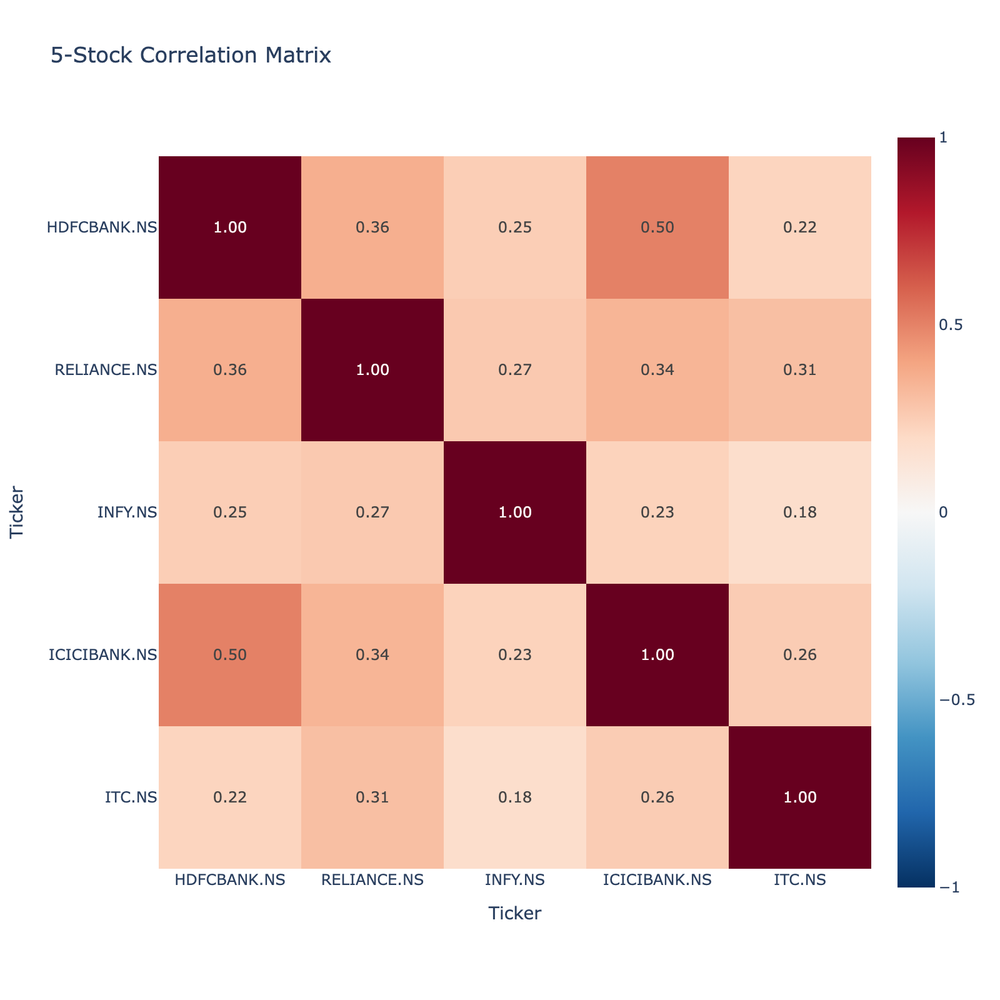
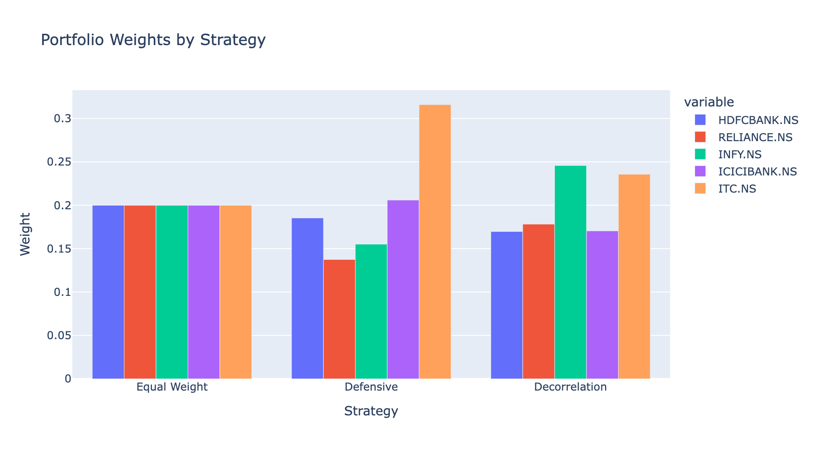
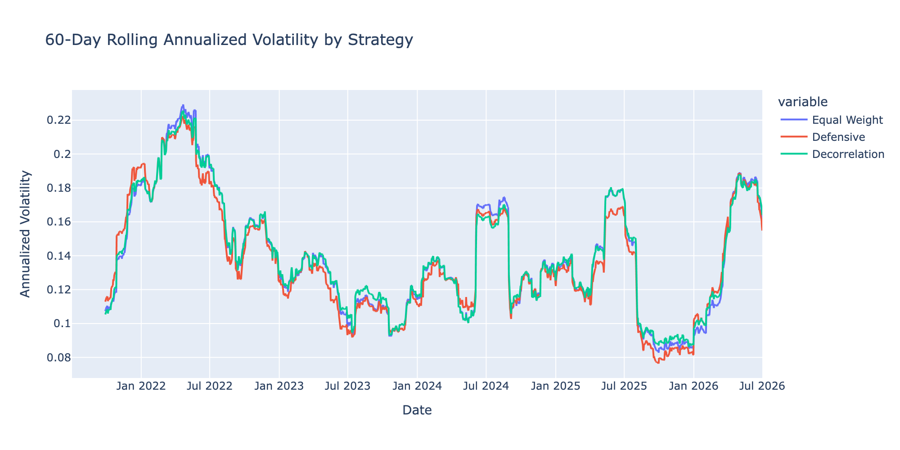
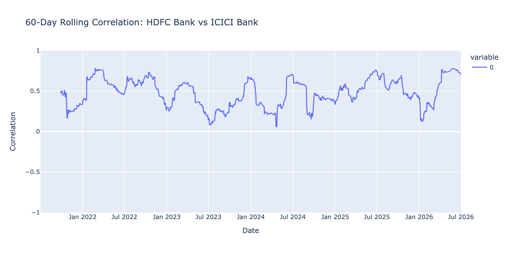

# India Risk Dashboard
A Python tool for risk analysis of Indian equities.

## What it does
- Pulls live NSE/BSE stock data using yfinance
- Computes daily returns, annualised volatility, rolling volatility, Sharpe ratio, and maximum drawdown
- Compares risk-adjusted performance across the Nifty 50 index and individual stocks

## Sample output — Risk Report (Jan 2023 – Dec 2024)
| Ticker | Annualised Vol | Sharpe Ratio | Max Drawdown | Max DD Date |
|--------|----------------|--------------|---------------|-------------|
| Nifty 50 (^NSEI) | 12.14% | 0.637 | -10.93% | 2024-11-21 |
| HDFC Bank | 19.82% | 0.065 | -19.91% | 2024-02-14 |
| Reliance | 20.36% | -0.154 | -24.46% | 2024-12-20 |

## Key finding
Individual stocks (HDFC Bank, Reliance) carried significantly more risk than the Nifty 50 index but did not proportionally reward investors — Reliance's negative Sharpe ratio over this period means investors would have been better off in risk-free government securities. This illustrates the practical value of diversification.

## Week 1: Individual Stock & Portfolio Analysis

### Portfolio analysis
Built an equal-weighted 3-stock portfolio (HDFC Bank, Reliance, Infosys) to test diversification in practice.

| Metric | Value |
|--------|-------|
| Portfolio annualised volatility | 14.91% |
| Simple average of individual stock volatilities | 21.09% |
| **Diversification benefit** | **6.18 percentage points lower** |
| Portfolio 1-day VaR (95%) | -1.33% |
| Portfolio 1-day VaR (99%) | -2.50% |

**Key finding:** Combining three stocks from different sectors (banking, IT services, energy) reduced portfolio volatility by 6.18 percentage points versus the simple average of the individual stocks — a direct, quantified demonstration of diversification. This works because the pairwise correlations are low (0.17–0.34), meaning the stocks rarely have their worst days at the same time.

On a ₹10L portfolio, this analysis implies a 1-in-20 day loss exceeding ₹13,262 (95% VaR) and a 1-in-100 day loss exceeding ₹24,961 (99% VaR).

### Correlation matrix
| | HDFC Bank | Infosys | Reliance |
|---|---|---|---|
| HDFC Bank | 1.000 | 0.171 | 0.338 |
| Infosys | 0.171 | 1.000 | 0.246 |
| Reliance | 0.338 | 0.246 | 1.000 |

## Week 2: Portfolio Strategies & VaR

### Strategy comparison
Built and compared three portfolio weighting strategies — Equal Weight, Defensive, and Decorrelation — over the same Jan 2023–Dec 2024 period, then evaluated them on a risk-adjusted basis rather than raw return alone.

| Strategy | Annualised Return | Annualised Vol | Sharpe Ratio | Max Drawdown |
|---|---|---|---|---|
| Equal Weight | 8.68% | 14.91% | 0.146 | -11.43% |
| Defensive | 8.21% | 15.01% | 0.114 | -11.84% |
| Decorrelation | 7.46% | 15.45% | 0.062 | -11.95% |

**Key finding:** Decorrelation had the highest cumulative return on the growth-of-₹1 chart, but the lowest Sharpe ratio — it took on more volatility and a deeper drawdown without enough extra return to compensate. Equal Weight, despite a lower headline return, had the best risk-adjusted performance. This reinforces the same lesson as Week 1: the strategy that "wins" on a chart isn't necessarily the best one once risk is accounted for.

### Value at Risk — Historical vs. Monte Carlo
Calculated 1-day Value at Risk (VaR) for each strategy using two methods: Historical VaR (based on actual realized daily returns) and Monte Carlo VaR (based on 10,000 simulated days drawn from a multivariate normal distribution fitted to the same data).

| Strategy | Historical VaR 95% | MC VaR 95% | Historical VaR 99% | MC VaR 99% |
|---|---|---|---|---|
| Equal Weight | -1.33% | -1.51% | -2.50% | -2.13% |
| Defensive | -1.37% | -1.49% | -2.77% | -2.13% |
| Decorrelation | -1.33% | -1.54% | -2.47% | -2.13% |

**Key finding:** The two methods disagree on which strategy is riskiest. Historical VaR flags Defensive as the worst performer at both confidence levels — despite being built to minimize variance, it has the worst tail risk historically. Monte Carlo VaR instead shows all three strategies converging to nearly identical 99% VaR (~-2.13%), understating the risk that Historical VaR captures. This is the classic limitation of a normal-distribution assumption: real markets have "fatter tails" than a bell curve predicts, so Monte Carlo simulation structurally cannot reproduce extreme historical events. This illustrates that **VaR methodology choice can change which portfolio looks riskiest** — a key reason risk teams use multiple approaches rather than relying on one.

## Week 3: Multi-Asset Extension & Stress Testing

*Note: Week 3 analysis uses a 5-year lookback period (vs. the Jan 2023–Dec 2024 window used in the Weeks 1–2 samples above).*

**Status:** Complete | Notebooks: `Week3_Day1.ipynb`, `Week3_Day2.ipynb`, `Week3_Day3.ipynb`

### What's new
- Extended portfolio from 3 to 5 NSE stocks: HDFC Bank, Reliance, Infosys, ICICI Bank, ITC
- Added interactive correlation heatmap (Plotly)
- Generalized `risk_report()` to accept a DataFrame and report on any number of assets/portfolios in a single call
- Recomputed all three weighting strategies (Equal Weight, Defensive/min-variance, Decorrelation) for 5 assets
- Compared Historical vs Monte Carlo VaR for 5-stock strategies
- Stress-tested the 5-year-optimized portfolio against the COVID crash (Feb–Apr 2020)
- Analyzed rolling 60-day volatility and HDFC–ICICI correlation across the full sample period

### 5-Stock Strategy Metrics (5-year period)

| Strategy | Ann. Return | Ann. Volatility | Sharpe | Max Drawdown | Historical VaR (95%) |
|---|---|---|---|---|---|
| Equal Weight | 8.84% | 14.30% | 0.164 | -21.64% | -1.35% |
| Defensive | 10.07% | 14.06% | 0.254 | -23.78% | -1.33% |
| Decorrelation | 8.36% | 14.33% | 0.130 | -23.60% | -1.38% |

### Historical vs Monte Carlo VaR (5-stock)

| Strategy | Historical VaR | Monte Carlo VaR | Difference |
|---|---|---|---|
| Equal Weight | -1.35% | -1.43% | +0.08% |
| Defensive | -1.33% | -1.44% | +0.11% |
| Decorrelation | -1.38% | -1.46% | +0.09% |

### COVID Stress Test (Feb–Apr 2020, weights from 5-year optimization)

| Strategy | Ann. Return | Ann. Volatility | Sharpe | Max Drawdown | Historical VaR (95%) |
|---|---|---|---|---|---|
| Equal Weight | -42.99% | 59.56% | -0.831 | -37.34% | -6.33% |
| Defensive | -48.35% | 57.79% | -0.949 | -36.38% | -5.89% |
| Decorrelation | -41.65% | 58.21% | -0.827 | -36.37% | -6.19% |

### Rolling Analysis

### Key findings
1. **Strategy ranking flipped from Week 2.** With 5 stocks, Defensive leads on Sharpe (coincidence of this dataset — ICICI Bank and ITC happened to have both the lowest volatility and best individual Sharpe ratios, so min-variance optimization captured return upside it wasn't designed to target). Equal Weight still wins on max drawdown.
2. **Historical vs Monte Carlo VaR gap narrowed and reversed sign** compared to the 3-stock Week 2 result — diversification across 5 stocks pulled the return distribution closer to normal, reducing (but not eliminating) the fat-tail effect.
3. **Defensive failed under stress.** The same strategy that won on Sharpe in calm conditions became the worst performer during the COVID crash (Sharpe -0.95 vs -0.83 for the others) — its min-variance weights were optimized against a covariance structure that broke down exactly when it mattered. Demonstrates a core limitation of static mean-variance optimization.
4. **Correlation is regime-dependent, not stable.** Rolling 60-day HDFC–ICICI correlation cycles between ~0.15 and ~0.75 even in normal conditions, and reached 0.80 during the COVID stress test — crisis periods push correlation toward the upper end of an already-volatile range rather than creating an entirely new regime.

## Week 4: Interactive Streamlit Dashboard

🔗 **Live Dashboard:** [india-risk-dashboard-eshaan.streamlit.app](https://india-risk-dashboard-eshaan.streamlit.app)

Built an interactive Streamlit dashboard (`app.py`) bringing together Weeks 1–3 into a single live application:
- Dynamic ticker selector (choose any subset of the 5-stock universe)
- Strategy toggle (Equal Weight, Defensive/Min-Variance, Decorrelation)
- Live-updating portfolio weights chart
- Live-updating correlation heatmap
- Generalized `risk_report()` function — now works across any stock subset and any weighting, not just fixed portfolios
- Historical VaR vs Monte Carlo VaR comparison with dynamic interpretation
- Cumulative returns chart (growth of ₹1 invested)
- On-demand COVID crash stress test (Feb–Apr 2020) with before/after metrics comparison

Key finding: the VaR method divergence (Historical vs Monte Carlo) isn't one-directional — which method is more conservative depends on the specific stock/strategy combination selected, not a fixed relationship.

**Run locally:** `streamlit run app.py`

## Week 5 — Sector Analysis, DCF Modeling & SQL Basics

**Day 1 — Sector Filter (Streamlit Dashboard)**
- Added sector-level filtering (`SECTOR_MAP`) that cascades to stock selection
- New Sector Allocation donut chart showing concentration risk by sector
- Fixed a stale-selection bug (multiselect not pruning invalid options after filter changes)
- Added graceful empty-state handling (guard clause instead of app crash on zero selections)
- Shipped to production: [live dashboard](https://india-risk-dashboard-eshaan.streamlit.app)

**Day 2 — DCF Valuation Model (Excel)**
- Built a full 5-year DCF model for Infosys using real FY26 financials (revenue, operating margin, net cash position)
- Covered revenue projection, NOPAT/FCF build, WACC-based discounting, Gordon Growth terminal value, and equity value → implied share price
- Sensitivity test: recalibrating the growth assumption from an optimistic 8% to guidance-aligned 3% moved the model's implied fair value from ₹1,259 to ₹1,041.51 — converging almost exactly with Infosys's actual market price (~₹1,042) at the time
- Key takeaway: terminal value drove ~74% of enterprise value, demonstrating how sensitive DCF outputs are to long-term growth/WACC assumptions

**Day 3 — SQL Basics**
- Built a local SQLite database (`india_risk.db`) from the project's stock price data
- Covered `SELECT`, `WHERE`, `ORDER BY`, `GROUP BY` with aggregates, and `JOIN` across a price table and a sector reference table
- Applied SQL to the same sector-grouping logic used in the Streamlit dashboard, reinforcing how reference-table joins work in production databases

**Status:** Week 5 complete. Dashboard is feature-complete through sector filtering; DCF and SQL fundamentals now part of the skillset alongside the core Python/Streamlit project.

## Built with
Python, pandas, yfinance, numpy, scipy, Plotly

## Status
🚧 In progress — Week 4 of 8 complete. Next: Week 5.
